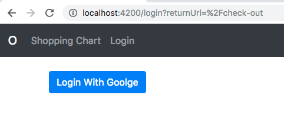
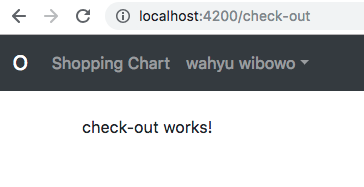

# Kemampuan Akhir Yang Direncanakan

- Peserta mengetahui penggunaan localstorage pada angular

# Percobaan 13 LocalStorage

- pada percobaan sebelum pada saat kita belum login kita ketik **localhost:4200/check-out** tidak bisa dikarenakan adanya auth guard sehingga user tidak bisa sembarangan masuk ke halaman lain sebelum login

- pada percobaan berikut ini kita akan mencoba mengredirect user ke halaman yang telah diketikan saat sebelum login menggunakan **localstorage**

- langkah pertama buka file **auth-guard.service.ts** dan rubah beberapa code sehingga menjadi seperti berikut:

```
import { Observable} from 'rxjs';
import { AuthService } from './auth.service';
import { Injectable } from '@angular/core';
import { Router, RouterStateSnapshot,ActivatedRouteSnapshot,CanActivate} from '@angular/router';
import { map } from 'rxjs/operators';

@Injectable({
  providedIn: 'root'
})

// @Injectable()
export class AuthGuard implements CanActivate{

  
  constructor(private auth:AuthService,private router:Router) { }

  // tambahkan parameter route,state:RouterStateSnapshot
    canActivate(route,state:RouterStateSnapshot): Observable<boolean> | Promise<boolean> | boolean
    {
      return this.auth.user$.pipe(
        map(user =>{
          if (user){
            return true;
          } 
          // tambahkan Sets query parameters to the URL.
          this.router.navigate(["/login"],{queryParams:{returnUrl:state.url}});
          return false;
        })
      );
    }
}
```
- jika benar ketik **localhost:4200/check-out** dengan kondosi belum login.Jika benar maka tampilannya akan seperti berikut



- buka file **auth.service.ts** tambahkan beberapa code sehingga keseluruhan code seperti berikut

```
import { Injectable } from '@angular/core';
import { AngularFireAuth } from 'angularfire2/auth';
import * as firebase from 'firebase';
import { Observable } from 'rxjs/internal/Observable';
import { ActivatedRoute } from '@angular/router';

@Injectable({
  providedIn: 'root'
})
export class AuthService {

  user$:Observable<firebase.User>;
  
  //tambahkan parameter ActivedRoute
  constructor(private afAuth:AngularFireAuth, private route :ActivatedRoute) {

    this.user$= afAuth.authState;
   }

   // tambahakan property snapshot pada route dan property queryParamMap
  login(){
    let returnUrl=this.route.snapshot.queryParamMap.get('returnUrl')||'/';
    localStorage.setItem('returnUrl',returnUrl);
    this.afAuth.auth.signInWithRedirect(new firebase.auth.GoogleAuthProvider());
  }

  logout(){
    this.afAuth.auth.signOut();
  }
}

```

- buka file **app.component.ts** tambahkan code berikut pada **class appcomponent**

```
 constructor(private auth:AuthService,private router:Router){
    auth.user$.subscribe(user=>{
      if(user){
        let returnUrl = localStorage.getItem('returnUrl');
        router.navigateByUrl(returnUrl);
      }
    })
  }
```
- sehingga keseluruhan code **app.component.ts**

```
import { Component } from '@angular/core';
import { AuthService } from './auth.service';
import { Router } from '@angular/router';

@Component({
  selector: 'app-root',
  templateUrl: './app.component.html',
  styleUrls: ['./app.component.css']
})
export class AppComponent {
  constructor(private auth:AuthService,router:Router){
    auth.user$.subscribe(user=>{
      if(user){
        let returnUrl = localStorage.getItem('returnUrl');
        router.navigateByUrl(returnUrl);
      }
    })
  }
}

```
- jika benar maka user akan diarahkan langsung kehalaman check-out setelah login **dengan syarat user harus mengetik localhost:4200/check-out dengan kondisi belum login**


