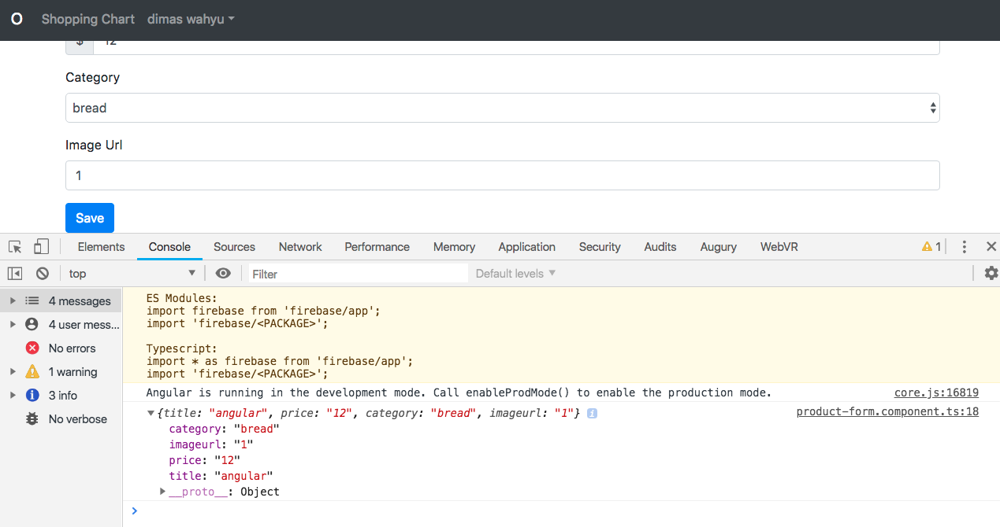
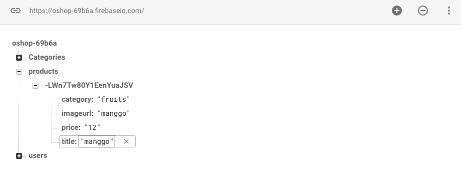

# Kemampuan Akhir Yang Direncanakan

- Peserta mampu menyimpan product ke firebase

# Percobaan 20  Insert product ke firebase

- tambahkan **ngModel** pada file **product-form.component.html** dan **method save**

```
<form #f="ngForm" (ngSubmit)="save(f.value)"> 
  <div class="form-group">
    <label for="title">Title</label>
    <input ngModel name="title" type="text" id="title" class="form-control">
  </div>

  <div class="form-group">
  <label for="price">Price</label>
  <div class="input-group mb-3">
      <div class="input-group-prepend">
        <span class="input-group-text">$</span>
      </div>
      <input  ngModel name="price" id ="price" type="text" class="form-control">
    </div>
  </div>
  
  <div class="form-group">
    <label for="category">Category</label>
    <select  ngModel name="category"  type="text" id="category" class="form-control">
      <option value=""></option>
      <!-- tambahkan code berikut -->
      <option *ngFor="let c of categories$ | async" [value]="c.key">
        {{c.key}}
      </option>
    </select>
  </div>

  <div class="form-group">
    <!-- rubah image-url menjadi imageurl agar memudahkan -->
    <label for="imageurl">Image Url</label>
    <input  ngModel name="imageurl"  type="text" id="imageurl" class="form-control">
  </div>
  <button class="btn btn-primary">Save</button>
</form>


```


- buka file **app.module.ts** dan  **import formModule**

```
import { FormsModule } from '@angular/forms';

```

- tambahkan juga pada **imports**

```
FormsModule

```

- sehingga keseluruhan code pada **app.module.ts** sebagai berikut

```
import { BrowserModule } from '@angular/platform-browser';
import { NgModule } from '@angular/core';
import { AngularFireModule } from 'angularfire2';
import { AngularFireDatabaseModule } from 'angularfire2/database';
import { AngularFireAuthModule } from 'angularfire2/auth';
import { environment } from 'src/environments/environment';
import { RouterModule} from '@angular/router';
import { NgbModule} from '@ng-bootstrap/ng-bootstrap';


import { AppComponent } from './app.component';
import { BsNavbarComponent } from './bs-navbar/bs-navbar.component';
import { HomeComponent } from './home/home.component';
import { ProductsComponent } from './products/products.component';
import { ShoppingChartComponent } from './shopping-chart/shopping-chart.component';
import { CheckOutComponent } from './check-out/check-out.component';
import { OrderSuccessComponent } from './order-success/order-success.component';
import { MyOrdersComponent } from './my-orders/my-orders.component';
import { AdminProductsComponent } from './admin/admin-products/admin-products.component';
import { AdminOrdersComponent } from './admin/admin-orders/admin-orders.component';
import { LoginComponent } from './login/login.component';
import { AuthService } from './auth.service';
import { AuthGuard } from './auth-guard.service';
import { UserService } from './user.service';
import { AdminAuthGuard } from './admin-auth-guard.service';
import { ProductFormComponent } from './admin/product-form/product-form.component';
import { CategoryService } from './category.service';
import { FormsModule } from '@angular/forms';

@NgModule({
  declarations: [
    AppComponent,
    BsNavbarComponent,
    HomeComponent,
    ProductsComponent,
    ShoppingChartComponent,
    CheckOutComponent,
    OrderSuccessComponent,
    MyOrdersComponent,
    AdminProductsComponent,
    AdminOrdersComponent,
    LoginComponent,
    ProductFormComponent
  ],
  imports: [
    BrowserModule,
    FormsModule,
    AngularFireModule.initializeApp(environment.firebase),
    AngularFireDatabaseModule,
    AngularFireAuthModule,
    NgbModule.forRoot(),
    RouterModule.forRoot(
      [
        {path:'',component:HomeComponent},
        {path:'products',component:ProductsComponent},
        {path:'shopping-chart',component:ShoppingChartComponent},
        {path:'check-out',component:CheckOutComponent, canActivate:[AuthGuard]},
        {path:'order-success',component:OrderSuccessComponent,canActivate:[AuthGuard]},
        {path:'orders',component:MyOrdersComponent,canActivate:[AuthGuard]},
        {path:'login',component:LoginComponent},
        {path:'admin/admin-products',
              component:AdminProductsComponent,
              canActivate:[AuthGuard,AdminAuthGuard]},
        {path:'admin/admin-products/new',
              component:ProductFormComponent,
              canActivate:[AuthGuard,AdminAuthGuard]},
        {path:'admin/admin-orders',
              component:AdminOrdersComponent,
              canActivate:[AuthGuard,AdminAuthGuard]},        
      ]
    )
  ],
  providers: [
    AuthService,
    AuthGuard,
    UserService,
    AdminAuthGuard,
    CategoryService
  ],
  bootstrap: [AppComponent]
})
export class AppModule { }


```
- buka file **product-form.component.ts** tambahkan sebuah method save dan tambahkan code berikut untuk mengecek inputan

```
   save(product){
     console.log(product);
   }

```
- isikan form dengan sebarang data dan save jika benar maka tampilannya akan seperti berikut:



- generate product

```
ng g s product
```

- tambah **product service pada app.module.ts**

```
 providers: [
    AuthService,
    AuthGuard,
    UserService,
    AdminAuthGuard,
    CategoryService,
    ProductService
  ],
```

- buka file **product-form.component.ts** dan modifikasi codenya menjadi

```
import { Component, OnInit } from '@angular/core';
import { CategoryService } from 'src/app/category.service';
import { ProductService } from 'src/app/product.service';

@Component({
  selector: 'app-product-form',
  templateUrl: './product-form.component.html',
  styleUrls: ['./product-form.component.css']
})
export class ProductFormComponent implements OnInit {

  categories$;

  constructor(categoryService:CategoryService,private productService:ProductService) {
    this.categories$=categoryService.getCategories();
   }

   save(product){
    //  console.log(product);
    this.productService.create(product);
    
   }

  ngOnInit() {
  }

}

```

- buka file **product.service.ts** tambahkan code berikut 

```
import { Injectable } from '@angular/core';
import { AngularFireDatabase } from 'angularfire2/database';

@Injectable({
  providedIn: 'root'
})
export class ProductService {

  constructor(private db:AngularFireDatabase) { }

  create(product){
    return this.db.list('/products').push(product);
  }
}
```
- lakukan uji coba masukkan file isikan form , save dan buka firebase anda, jika berhasil maka tampillan akan seperti pada gambar


